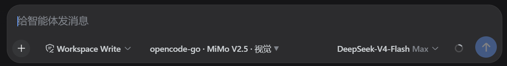
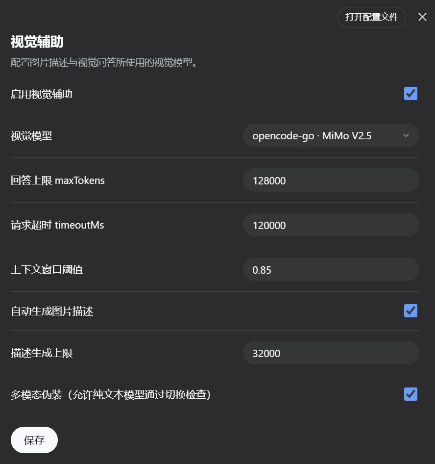
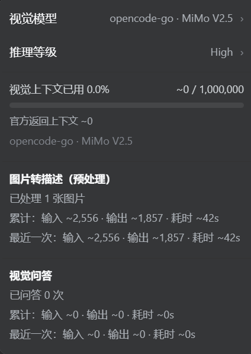

# dsh-visual-aid

[dsh](https://github.com/deepseek-ai/deepseek-harness) 的纯插件，用于让“纯文本主模型”也能处理带图片的会话。它会把图片理解委托给一个支持图片输入的视觉模型。

本插件**不修改 dsh 核心源码**，所有代码都在 `packages/visual-aid/` 目录内。

## 为什么需要它

DeepSeek chat-completions 这类文本模型不支持图片内容。如果会话里包含图片，直接发给主模型会报错：

```
The DeepSeek chat-completions adapter does not support image content.
UNSUPPORTED_CONTENT
```

`dsh-visual-aid` 的解决方式：

1. 检测会话中的图片。
2. 调用配置好的视觉模型生成图片描述。
3. 在请求主模型之前，把图片块替换成带编号的文字占位符。
4. 提供 `view_image(#N, question)` 工具，让主模型仍能针对原图追问。

## 功能特性

- **自动图片替换**：启用后，主模型请求不会看到原始图片块。
- **`view_image` 工具**：让主模型向视觉模型追问编号图片。
- **`visual_read_image` 工具**：通过插件自有路径读取磁盘图片文件。
- **会话开关**：`/visual-aid on|off` 或 Web 顶部开关。
- **关闭即完全停用**：从顶部选择“关闭”后，会同步关闭设置页中的“视觉辅助”，并且不再执行图片转描述、请求投影或 `view_image`/`visual_read_image`。
- **设置界面**：在 dsh Web 设置中提供“视觉辅助 / Visual Aid”配置项。
- **视觉对话面板**：展示图片问答历史、丢弃警告和 Token 统计。
- **分支继承**：fork 出的新会话会继承父会话已生成的图片描述，避免分支后重复生成、浪费 Token。
- **压缩后编号稳定**：图片编号在压缩/compact 后保持单调递增，不重复使用。
- **多模态伪装**：设置中提供独立开关，允许纯文本主模型通过 dsh 的模型切换检查（需配合 visual-aid 正常使用，风险自负）。
- **不改核心**：以正常 dsh 插件 bundle 方式安装。

## 目录结构

```text
packages/visual-aid/
├── README.md
├── AGENTS.md
├── visual-aid/                  # Host 后端插件
│   ├── src/
│   │   ├── index.ts             # 插件生命周期、工具、投影、存储、分支继承
│   │   ├── channel.ts           # 图片收集、替换、视觉请求构建
│   │   └── config.ts            # 插件配置结构
│   └── tests/
└── client-ui-visual-aid/        # Web 客户端插件
    ├── src/
    └── tests/
```

## 界面预览

安装并启用后，主要界面如下：

### 顶部按钮



### 设置页



### 视觉面板



## 安装

发布到 npm 后，可以通过 bundle 安装到 dsh profile：

```bash
dsh plugin --profile web add @sy008/dsh-visual-aid-bundle@0.1.0-rc.9
```

本地开发时，可以打包后安装：

```bash
# 安装依赖
pnpm install

# 构建 host 和 client
pnpm exec tsc -b packages/visual-aid/visual-aid/tsconfig.json
pnpm exec tsdown --env.DSH_BUILD_FACE host

# 创建本地 bundle（具体步骤见 AGENTS.md）
dsh plugin --profile web add file:/path/to/dsh-visual-aid-bundle
```

安装后重启 dsh，并在设置中启用 Visual Aid，或使用：

```text
/visual-aid on
```

### Ubuntu / Linux 安装

插件本身是跨平台的，Linux 下数据默认保存在：

```text
~/.dsh/visual-aid/
```

从 npm 发布后安装：

```bash
dsh plugin --profile web add @sy008/dsh-visual-aid-bundle@0.1.0-rc.9
```

使用本地 bundle 安装：

```bash
dsh plugin --profile web add file:/path/to/dsh-visual-aid-bundle
```

安装后重启 dsh，并在设置中启用 Visual Aid。

### Windows 安装

插件本身是跨平台的，Windows 下数据默认保存在：

```text
%USERPROFILE%\.dsh\visual-aid\
```

如果使用本地 bundle，把整个 bundle 文件夹（包含 `package.json`、`cordis.patch.yml` 和两个 `.tgz`）复制到 Windows，然后在 PowerShell 中执行：

```powershell
dsh plugin --profile web remove dsh-visual-aid-bundle
dsh plugin --profile web add file:C:\path\to\bundle
```

如果 bundle 内使用相对路径引用 tarball，则整个文件夹可以整体复制，路径改成 Windows 实际路径即可。


## 配置项

插件由 `visual-aid` 设置区控制：

| 字段 | 说明 |
| --- | --- |
| `enabled` | 总开关。 |
| `provider` | 视觉模型的 provider id。 |
| `model` | 视觉模型的 model id。 |
| `maxTokens` | 视觉模型回答的最大 token 数。 |
| `timeoutMs` | 视觉模型调用超时。 |
| `describeImages` | 是否自动预生成图片描述。 |
| `describeMaxTokens` | 自动图片描述的最大 token 数。 |
| `channelWindowRatio` | 上下文窗口阈值（比例）：视觉问答最多使用视觉模型上下文窗口的比例。 |
| `masqueradeMultimodal` | 多模态伪装开关。开启后，非视觉模型的纯文本主模型也会被报告为支持图片，从而通过模型切换检查。 |

如果启用但没有配置视觉模型，插件会按“未启用”处理，保证纯文本会话仍可使用。

## 工作原理

### 主请求投影

`dsh-visual-aid` 全局监听 `llm/stream`。当请求包含图片块时：

1. 从会话中收集图片记录。
2. 对未描述的图片调用视觉模型生成描述。
3. 将图片块替换为类似下面的文字占位符：

   ```
   [Image #1: screenshot.png, 1920×1080 — 一个登录页面，显示……]
   ```

4. 把替换后的请求交给原主模型。

### 分支继承

当会话被 fork 时，插件会把父会话的 visual-aid 数据（图片描述、QA 历史、图片编号、开关状态）复制给子会话。这样分支后不会重新描述同一批图片。

### 存储

插件数据按会话独立保存：

```text
`~/.dsh/visual-aid/<session-id>.json`（Windows: `%USERPROFILE%\.dsh\visual-aid\<session-id>.json`）
```

该文件与会话日志分开存储。插件已安装时，fork 会自动复制该文件。

## 注意事项与常见踩坑

### 1. DeepSeek 纯文本模型不能直接接收图片

**现象：**

```
The DeepSeek chat-completions adapter does not support image content.
UNSUPPORTED_CONTENT
```

**原因：** DeepSeek chat-completions 不支持图片输入。如果 visual-aid 未启用、未配置视觉模型、或插件未正确安装，图片会原样发给主模型。

**解决：**

- 确认 visual-aid 已安装并启用。
- 在设置中配置一个支持图片输入的视觉模型。
- 如果仍然报错，重启 dsh 后重试。

### 2. 有图片的会话不能切换到纯文本模型

**现象：**

```
model-unavailable: Model "deepseek-v4-flash" does not accept image input,
but this session already contains images; select an image-capable model.
```

**原因：** dsh 核心在切换模型时会检查原始会话历史里是否有图片。这是核心保护逻辑，visual-aid 无法通过正规插件接口绕过。

**解决：**

- 继续使用支持图片的模型。
- 或执行 `/compact` 压缩掉图片历史后，再切换纯文本模型。
- 或新开一个不带图片历史的会话。

### 3. 分支后可能重新生成图片描述

**现象：** 从旧断点 fork 出新会话后，插件又对同一批图片重新调用视觉模型。

**原因：**

- 图片描述保存在 `~/.dsh/visual-aid/<session-id>.json`（Windows: `%USERPROFILE%\.dsh\visual-aid\<session-id>.json`），按 session id 隔离。
- 如果分支点早于描述生成完成，或插件当时未安装，子会话没有可继承的数据。
- 如果插件已安装且父会话已有描述，新版本会自动继承；旧版本或卸载状态下不会。

**解决：**

- 尽量从“已经生成过图片描述”的较新断点分支。
- 确认 visual-aid 已安装后再分支。
- 如果旧分支已经产生，可手动复制：
  ```bash
  cp ~/.dsh/visual-aid/<父session-id>.json ~/.dsh/visual-aid/<子session-id>.json
  ```
  然后重启 dsh。

### 4. 关闭 visual-aid 后，分支继承是否还有效

- **仅关闭设置（插件仍安装）：** 分支时仍会继承描述数据，但关闭状态下不会使用；重新开启后可直接复用。
- **彻底卸载插件：** 不会自动继承。需要手动复制数据文件，或在新会话中重新生成。

### 5. 插件升级后没有生效

**现象：** 改了代码或装了新包，但行为还是旧的。

**原因：** 如果版本号没变，pnpm 可能复用旧缓存/旧安装。

**解决：**

- 升级时修改版本号，避免同版本覆盖。
- 必要时删除 profile 下的 `pnpm-lock.yaml` 后重新安装。
- 安装后确认版本：
  ```bash
  grep '"version"' ~/.dsh/profiles/web/node_modules/@sy008/dsh-visual-aid/package.json
  ```

### 6. `/compact` 是处理图片历史的推荐方式

如果不想继续使用图片，或需要切换到纯文本模型：

```text
/compact
```

压缩后旧图片历史会被文字摘要替换，`deriveMessages()` 中不再包含原始图片，之后可以切换纯文本模型。

### 7. 插件数据文件位置

```text
`~/.dsh/visual-aid/<session-id>.json`（Windows: `%USERPROFILE%\.dsh\visual-aid\<session-id>.json`）
```

- 不要随意删除，否则会丢失已生成的图片描述和 QA 历史。
- 如果需要迁移/备份，复制这个目录即可。

### 8. 多模态伪装按钮

设置中的“多模态伪装”是一个**危险选项**：

- 它会让 dsh 误以为纯文本模型（如 `deepseek-v4-flash`）支持图片。
- 只有 visual-aid 正常启用并配置了视觉模型时，才能安全使用。
- 如果 visual-aid 未生效，切换后仍然会把图片发给 DeepSeek，导致 `UNSUPPORTED_CONTENT`。
- 这是为“必须切换模型”场景提供的 hack，不是官方推荐行为。

## 开发

### 环境要求

- Node.js 和 pnpm
- dsh monorepo 代码

### 常用命令

```bash
# 安装依赖
pnpm install

# 类型检查
pnpm exec tsc -p packages/visual-aid/visual-aid/tsconfig.json --noEmit
pnpm exec tsc -p packages/visual-aid/client-ui-visual-aid/tsconfig.json --noEmit

# 运行测试
./node_modules/.bin/vitest run packages/visual-aid/visual-aid/tests --config vitest.config.ts
./node_modules/.bin/vitest run packages/visual-aid/client-ui-visual-aid/tests --config vitest.config.ts

# 构建 host
pnpm exec tsdown --env.DSH_BUILD_FACE host

# 构建 client
pnpm exec tsdown --env.DSH_BUILD_FACE client
```

### 打包本地 bundle

具体打包和安装步骤见 `AGENTS.md`。

## 许可证

MIT，与 deepseek-harness 一致。
